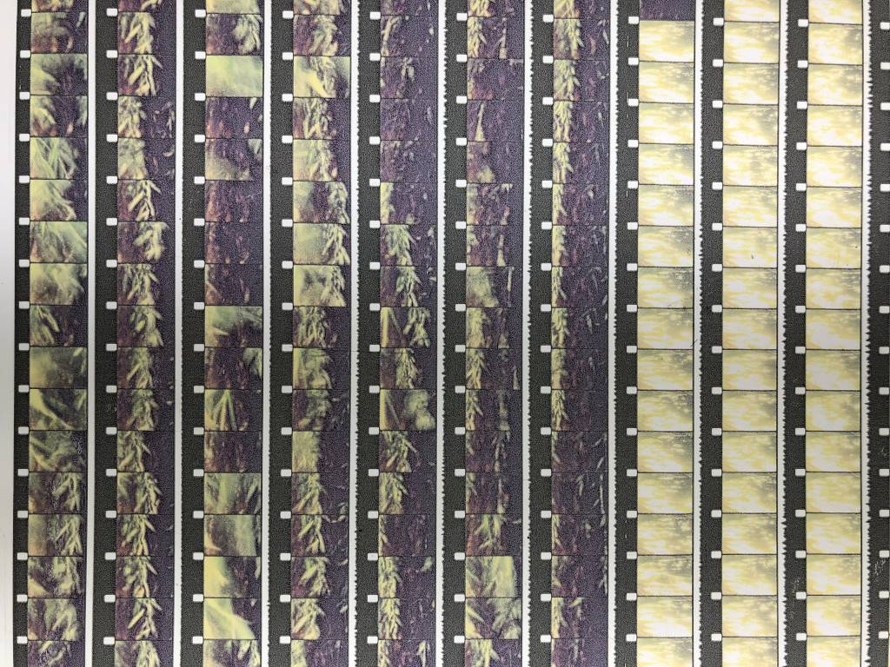
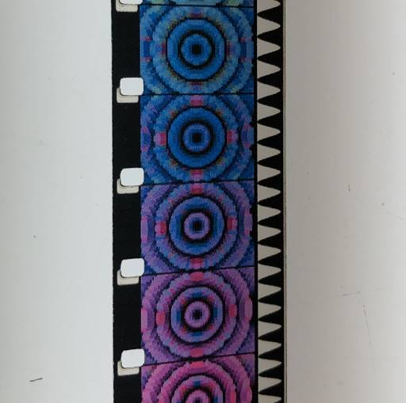
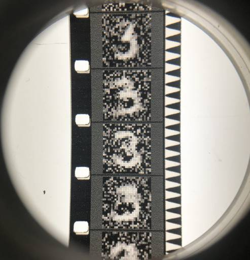

# filmless

Scripts and templates for making "filmless", cameraless analog films using free open-source software. 

Building off of the [v2f](https://github.com/sixteenmillimeter/v2f) application for generating film-sized strips of images, this is a set of tools for building pixel-perfect image sequences for printing and laser cutting into viable 16mm film strips. Create 16mm films from non-film materials and convert video to strips of film using [Processing](https://processing.org/).

### [Download](https://github.com/sixteenmillimeter/filmless/archive/master.zip)

## What this repository contains

1. [Laser cutting templates](#laser)
2. [Processing sketch for generating pages of film strips](#processing)
3. [Scripts for exporting video to image sequences](#scripts)
4. [Calibration](#calibration)
5. [Installation instructions for dependencies](#dependencies)

<a name="laser"></a>
## 1. Laser cutting templates


The laser cutting templates can be used on their own and without the other components. Use them to cut non-film materials into shapes that can be used in analog film machines. If all you want to do is laser cut materials into film shapes, you're almost done reading.

The provided [.svg](https://github.com/sixteenmillimeter/filmless/tree/master/svg) and [.dxf](https://github.com/sixteenmillimeter/filmless/tree/master/dxf) files can be opened in whichever application you use to control your laser cutter. With just these files you can cut twelve 33-frame strips of 16mm-sized film from any flat material that you can cut with your laser. Whether or not it will run through a projector depends on the material but at least you can cut it! This has been tried with paper, vellum, acetate and inkjet transparency film.


Using the provided [OpenSCAD](https://www.openscad.org/) file, `scad/16mm_film.scad`, you can generate .dxf or .svg files of your own dimensions. Build strips of any number of frames and generate any number of strips. Just change the variables `FRAMES` and `STRIPS` at the top of the file or use the new Customizer feature in the latest version of OpenSCAD. The default values are `FRAMES = 33` and `STRIPS = 12` which fits into a US Letter sized piece of paper (or inkjet transparency film).


For more advanced tweaks, you can change the `PITCH` variable from "long" to "short" to cut camera-sized short pitch film strips. You can also change the `PERFS` variable from "single"  to "double" for generating double perforated film strips. 

The "pitch" of the film refers to the distance between the perforations and it varies between camera stocks and projection stocks. If you plan on contact printing your results from this process, it may make sense to you to use "short" pitch (7.605mm). If you plan on scanning, optical printing or projecting your results, "long" pitch (7.62mm) may work best.

<a name="processing"></a>
## 2. Processing sketch for generating pages of film strips

This Processing sketch will create a printable page of 16mm-sized film strips from an image sequence. Generate an image sequence from a video file using the [convert.sh script](#scripts) or generate your own using your application of choice. Create standard strips of standard 16mm or Super16-sized images on single or double perforated film optionally containing a generated optical soundtrack.



If you have installed Processing and the required libraries ([read below](#ffmpeg)) you can use this sketch to generate pages containing strips of 16mm-sized images from image sequences. Using the default settings, this will build a page of 12 strips, each 33 frames long, that will comfortably fit on a letter-sized 8.5" x 11" sheet of inkjet transparency film.


By including a path to a *mono* audio file, tested only with .wav files so far, this sketch will build an optical soundtrack facsimile using the [SoundtrackOptical](https://github.com/sixteenmillimeter/SoundtrackOptical) library for Processing and sit it in the correct area of the film strip.


The sketch can be modified to accommodate different desired output; generating Super16 filmstrips, inverting your image to negative or creating double-perf film strips. [Read more about setting the sketch variables below.](#variables)


<a name="scripts"></a>
## 3. Scripts for exporting video to image sequences 

If you would like to generate images for printing and then laser cutting, you will need Processing and optionally [ffmpeg](https://www.ffmpeg.org/) for generating image sequences from video files. Using the provided `scripts/export.sh` script, you can quickly export an image sequence of .png files to your desktop that the processing sketch `filmless_processing.pde` will turn into pages of film strips to be printed and cut.

The other two scripts `calibration.sh` and `pages.sh` are for using [ImageMagick](https://imagemagick.org/index.php) to convert your resulting image files to the proper DPI for printing. More on this in the [calibration](#calibration) section.

### export.sh 

This script relies on `ffmpeg` which must be installed for it to work. Check out the [installation instructions below](#ffmpeg) for information about getting ffmpeg on your system.

To use the export script, first navigate to the `filmless` folder. If you downloaded the [.zip of the repository](https://github.com/sixteenmillimeter/filmless/archive/master.zip) and uncompressed it in your downloads folder then "/path/to/filmless" can be replaced with "~/Downloads/filmless-master" on macOS and Linux.

```bash
cd /path/to/filmless
```

Then, to run the export script simply pass in a path to your video as the first and only argument. In this example "/path/to/my/video.mov" will actually be a path to the video you wish you turn into an image sequence.

```bash
sh scripts/export.sh /path/to/my/video.mov
```

This will export the video in a .png sequence to a folder on your Desktop in a folder named "frames". This is the default directory that the `filmless_processing.pde` sketch will look for an image sequence. If your video contained any audio, it will be exported to a mono file named "audio.wav" in the "audio" folder now on your desktop. Otherwise you may see an error message in your terminal telling you that it couldn't find a stream. Not to worry.

You don't need to use this script to export your video to image sequences. You can use the application of choice to create your image sequences for the Processing sketch. This script simply lets you do that from the command line without opening up an NLE or media export program. 

You can alternately generate image sequences with other Processing sketches, thereby having a completely cameraless and **cough** filmless process for creating 16mm analog movies.



Note: Processing can only read .tif files produced by the application itself, so unless you are using an image sequence generated by Processing save your files as .png or .jpeg.

There are a few parameters to tweak in the script for best results.

```bash
WITH_SOUND=true
```

Changing "WITH_SOUND" to any value other than true will tell the script to not try to export audio. For everyone's sanity, it makes sense to change it to "WITH_SOUND=false" to keep it semantic, but I'm not your boss. Do what feels right.

```bash
AUDIO_RATE=10368
```

If you plan on using audio, this is important to pay attention to. The maximum sample rate of your audio is limited by the resolution of your printer. The maximum number of lines that can be used to describe the audio in a printed soundtrack can be determined by a relatively simple formula.

```
AUDIO_RATE = ONE SECOND OF FRAMES * FILM PITCH * (DPI / MM PER INCH)
```

Using long pitch film measurements and 1440 as our DPI. An inch is equal to 25.4mm. There are 24 frames in one second of 16mm film.

```
10368 = 24 * 7.62 * (1440 / 25.4)

```

Reducing the sample rate to the maximum that this process can produce serves two purposes: it gives you the best quality soundtrack in the minimum amount of processing time and it allows you to preview some of the distortion that you will hear in your printed soundtrack. Higher frequencies are impossible and you can mix accordingly.

The value you can use for the soundtrack sample rate will be output in both the `filmless_processing.pde` and `filmless_calibration.pde` sketches when you set your parameters, including your target DPI. [Read more about the calibration sketch](#calibration) below.

### calibration.sh

The default DPI of an image created by Processing is 72. Meanwhile, your printer is likely capable of printing at a much higher density. 600, 1200, 2880 or higher. When creating images meant for 1200 DPI but creating one that says it's only 72 DPI will create a nightmare when trying to print at "actual" size. 

Use this script to change your calibration .png files to the same DPI used to generate them. Then, when printing, you'll be able to tell your printer to scale the image to 100% rather than some fractional percentage (`1200 / 72` for example).

This script requires [ImageMagick](https://imagemagick.org/index.php) and will convert the images output by the `filmless_calibration.pde` sketch to the correct DPI for accurate scale printing. Make sure to set the `DPI` variable of the script to the same value used in the sketch. Running it will convert any .png in the "filmless_calibration" directory to the desired DPI.

```bash
sh scripts/calibration.sh
```

### pages.sh

Similar to the calibration script, this will convert your output .tif files from `filmless_processing.pde` to the correct DPI. Also set the `DPI` variable in this script to the one used in your Processing sketch. By default, this looks for files named `page_*.tif` on your Desktop.

<a name="calibration"></a>
#### 4. Calibration

The purpose of the calibration sketch `filmless_calibration.pde` is to generate a page to calibrate between your printer and laser cutter. The page it creates is easy on your ink cartridge while determine if there is any stretch or squish happening to your generated pages of film strips before you commit to printing them out for cutting.

You should re-perform this step when you change printers or any significant print settings that affect the quality or media you're printing onto.

The calibration sketch should be set up with the same variables you intend to use to generate your pages of film strips.

```java
int DPI = 1440;
String PITCH = "long";
String FORMAT = "16mm";
float PAGE_W = 8.5;
float PAGE_H = 11.0;
float SAFE_W = .25;
float SAFE_H = .5;
```

This sketch produces an image that is the same size as one page produced by `filmless_processing.pde` that contains four 10mm x 10mm squares on the outer corners of the image area and contains two 100mm rulers along both the horizontal and vertical axises.


The "magic" variables determine the overall stretch or squash of the entire page. When set to 1, the resulting page will not be changed. When set above 1 the page has its height or width stretched and below 1 will cause it to be squashed.

```java
float MAGIC_H_CORRECTION = 1.0; 
float MAGIC_W_CORRECTION = 1.0;
```

After printing your calibration page, measure the rulers and ensure that they are the correct length. If, for example, you measure the "height" ruler to actually be 99mm instead of 100mm, you can set the `MAGIC_H_CORRECTION` value to `100.0 / 99.0` which will result in a stretch value of `1.0101010101010102`. If the same ruler actually measured 103mm, you can achieve a squash with the line `MAGIC_H_CORRECTION = 100.0 / 103.0` which is equivalent to `0.970873786407767`.

After measuring and calculating your "magic" values, print another test sheet and confirm that your rulers are the correct length. Then, these two values should be used in your `filmless_processing.pde` when generating your images.

The calibration sketch also outputs useful data into your Processing logs, such as the total image size and soundtrack sample rate for you to use in other scripts. It will look similar to the below output.

```
PAGE SIZE: 11520x14400
FRAME SIZE: 582x425
FRAMES PER STRIP: 33
STRIPS PER PAGE: 12
FRAMES PER PAGE: 396
CALIBRATION W (MM): 192
CALIBRATION H (MM): 251.45999
SOUNDTRACK SAMPLE RATE: 10368
```

<a name="dependencies"></a>
## Dependencies

* [Processing](https://processing.org/) - [[Download](https://processing.org/download/)]
* [Sound library for Processing](https://processing.org/reference/libraries/sound/index.html) - [[Installation instructions]()]
* [SoundtrackOptical library for Processing](https://github.com/sixteenmillimeter/SoundtrackOptical)
* (optional) [ffmpeg](https://www.ffmpeg.org/) - [[Download](https://www.ffmpeg.org/download.html)] or [[Installation instructions](#ffmpeg)]
* (optional) [OpenSCAD](https://www.openscad.org/) - [[Download](https://www.openscad.org/downloads.html)]
* (optional) [ImageMagick](https://imagemagick.org/index.php) - [[Download](https://imagemagick.org/script/download.php)] or [[Installation instructions](#ffmpeg)]

<a name="ffmpeg"></a>
## Installing ffmpeg and/or ImageMagick

### macOS

On a Mac, ffmpeg can be quickly and easily installed using the [Homebrew](https://brew.sh) package manager. Simply go to [https://brew.sh](https://brew.sh) and follow the instructions on the page. Then, 

```bash
brew install ffmpeg
```

To install ImageMagick (which will include the program `convert`):

```bash
brew install imagemagick
```

### Linux

Install both ffmpeg and ImageMagick on Linux systems with either apt or yum.

```bash
apt install ffmpeg imagemagick
```

or

```bash
yum install ffmpeg imagemagick
```

### Windows

The scripts are tested on macOS and Linux, but can be converted to work with Windows operating systems with few edits. Check the install links above for the Windows executables for ffmpeg and ImageMagick. Happy to accept pull requests for updates to the bash scripts to support all operating systems.

------

<a name="variables"></a>
## Processing variables

There are variables at the beginning of the sketch that you will need to change to properly generate pages from your images.

```java
String DESKTOP = System.getProperty("user.home") + "/Desktop";
```

This line does not need to be used or changed, but will find the "Desktop" folder for the current user. This is useful if you wish to place your files in an easy-to-reach destination while generating files.

```java
String SOURCE = DESKTOP + "/frames/";
```

The `SOURCE` variable will point to the directory containing your image sequence. This can be changed completely or used as is if you place your image sequence in a folder named "frames" on your desktop and include the images.

```java
String SOUND = DESKTOP + "/audio/audio.wav";
```

The `SOUND` variable is optional. To include sound, use the path of a mono audio file. In the default setting, it will look for a file named "audio.wav" in a folder named "audio" on your Desktop. If you do not wish to use sound, change the line to this to generate a silent track: `String SOUND = "";`

```java
String RENDER_PATH = DESKTOP + "/";
```

This variable controls the output location for the `page_#.tif` files that will be produced by the sketch. These files can be LARGE (500MB to 2GB) so point this to a directory with a lot of space. Keep in mind, you will produce one of these pages for every 396 frames using the default settings, so a 4000 frame sequence will produce 11 pages. That as much as 22GB (or more) so plan accordingly.

```java
String SOUNDTRACK_TYPE = "unilateral";
```

The soundtrack type refers to the style of soundtrack that's produced by the sketch. The soundtrack is produced using [SoundtrackOptical](https://github.com/sixteenmillimeter/SoundtrackOptical) and the options are `unilateral`, `variable area`, `dual variable area`, `maurer`, `variable density`. Read more about these different types [here](http://www.paulivester.com/films/filmstock/guide.htm).

```java
int DPI = 1440;
```

The DPI is the target for printing. The maximum DPI you'll be able to print is dependent on your printer or image reproduction technology. The higher the DPI, the higher the theoretical resolution of your output. This variable will also determine your sound quality, as you will only be able to reproduce the number of samples the vertical resolution allows. If your printer can only draw 10,000 lines in 24 frames, your sample rate will effectively be 10Khz. 

```java
String PITCH = "long";
```

The pitch of the film refers to the distance between the perforations. Long pitch films are generally projection films, while short pitch films are for cameras. If you plan on contact printing your generated film, you should change the variable to `short`.

Make sure that if you change this setting, you use the provided `_long.svg` or `_short.svg` (or .dxf files) or change the setting in the `16mm_film.scad` file when generating your own.

```java
String FORMAT = "16mm";
```

`FORMAT` refers to the image format that your film strips will use. Either `16mm` for standard 16mm or `super16` for Super16.

Keep in mind: This sketch will scale your video frames to fit the size of the film frames. If you choose a standard 16mm format any frames provided to the script will be scaled to a ~4:3 aspect ratio. If you provide 1080P frames, they will be squashed from 16:9 to the square-ish 4:3 ratio. Conversely, if you choose the super16 format using `String FORMAT = "super16";` your 4:3 frames will be stretched to 1.66:1. 

Best practice would be to run the `filmless_calibration.pde` sketch with your desired settings and look for this line in the logs: `FRAME SIZE: 582x425` and then scale your video yourself to that size; optimizing the cropping or scaling before you export your frames for `filmless_processing.pde`.

Another thing to note: Super16 and soundtracks occupy the same space on the filmstrip and the script will throw an error if you try to include both audio and a Super16 image format.

```java
int PERFS = 1;
```

Refers to the number of perforations that will be printed as guides for your film. Can be either `1` or `2`. Similar to the conflict between Super16 and soundtracks, the second perforation on "double perf" film strips will occupy the same area that soundtracks and Super16 images do. If you intend to cut double perf film, use the proper .svg or .dxf file with 2 perforations per frame.

```java
float PAGE_W = 8.5;
float PAGE_H = 11.0;
float SAFE_W = .25;
float SAFE_H = .5;
```

Change these only when printing on larger format sheets than standard US letter stock. The "SAFE_" variables refer to the areas on both sides of the width or height of the sheet which will not be printed on. Changing these to higher values will reduce the maximum amount of frames that are able to be printed on a single sheet. If you see the number of frames or strips change in the logs of the script, you should generate a new .svg or .dxf to match.

Using these default settings the script will generate 12 strips of 33 frames each, totally 396 frames per page.

```java
color BACKGROUND = color(0);
```

The color that will fill the entire frame where there's no image or soundtrack data. The `color()` method will accept grey values from `0` (black) to `255` (white) or will accept 8-bit RGB color values like `color(255, 0, 0)` (red), `color(0, 255, 0)` (green), `color(0, 0, 255)` (blue) or anything in between those values.  

```java
boolean NEGATIVE = false;
```

Change this value from `false` to `true` to invert the colors of your images. Use this for contact printing or other experimental uses. Keep in mind: this will not perform the orange color mask inversion needed for color contact printing but will naively invert all color values.

```java
boolean SHOW_PERFS = true;
```

Set to `true` to print perfs for cutting registration. Set to `false` to print nothing.

```java
color PERFS_COLOR = color(255);
```

Set the color of the perforations, similar to `BACKGROUND`. By default, they will be drawn white.

```java
int SOUND_OFFSET = 25;
```

The sound offset is the number of frames before the image starts after the soundtrack starts. When set to `25` the image will start on the 26th frame, which is the standard for 16mm prints. Change this only if sync sound is not important.

To set the `MAGIC_W_CORRECTION` and `MAGIC_H_CORRECTION` variables, read the section on [calibration](#calibration).